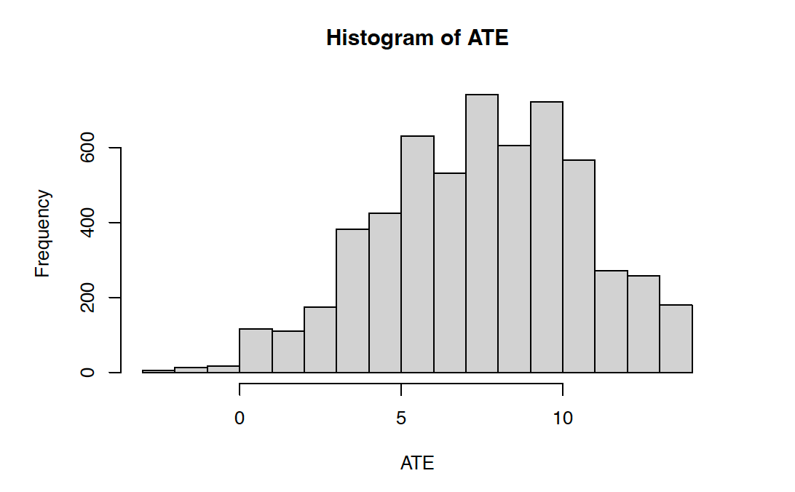
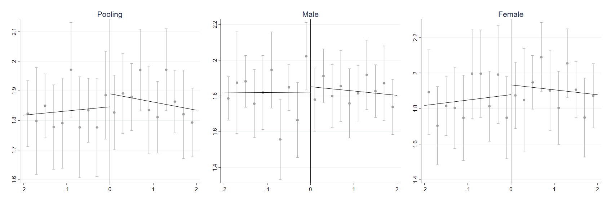

# Causal_Inference

## AB testing: the effect of small class sizes on learning

-  Our team analyzed a four-year educational experiment aiming to evaluate the effect of small class sizes on learning. We tested the balance between treated and controlled. We solved the nasty school network effect by considering cluster-robust standard error and school fixed effect. We estimated heterogeneous effects comprehensively by considering the interaction between treatment and personal characteristics. 

<figure>

<figcaption> Fig.1 Heterogeneous Effects </figcaption>
</figure>

## Final Project: estimate the mental health effect of retirement
- 	How could you estimate the mental health effect of retirement when you cannot randomly assign people to retirement? My teammate and I used compulsory retirement age as the instrumental variable for retirement to achieve such a goal. We also check all required assumptions to ensure validation of our inference. 

